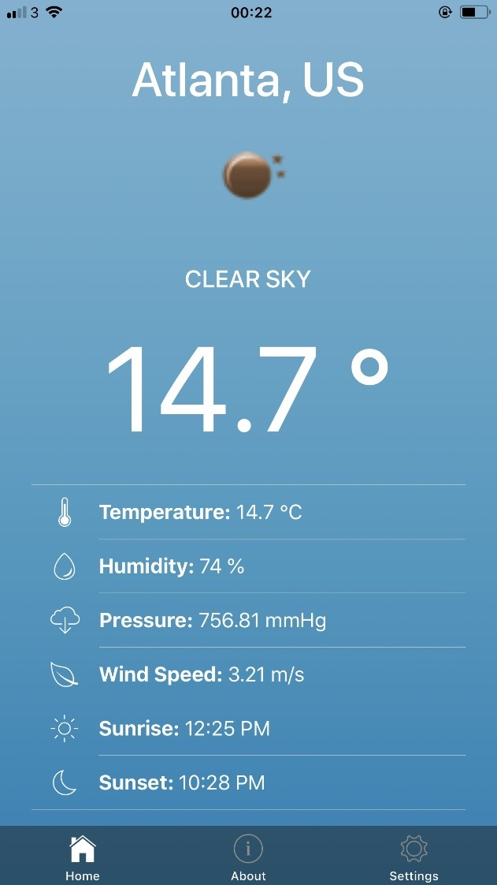
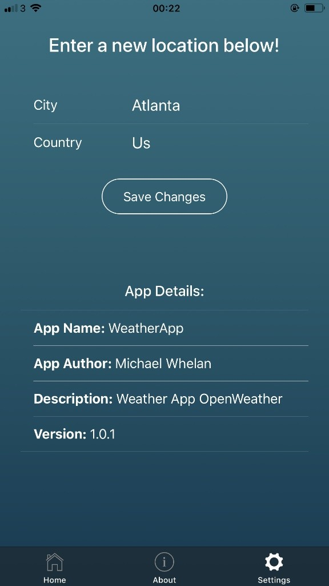
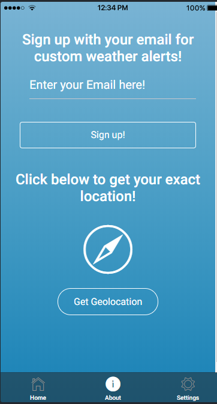
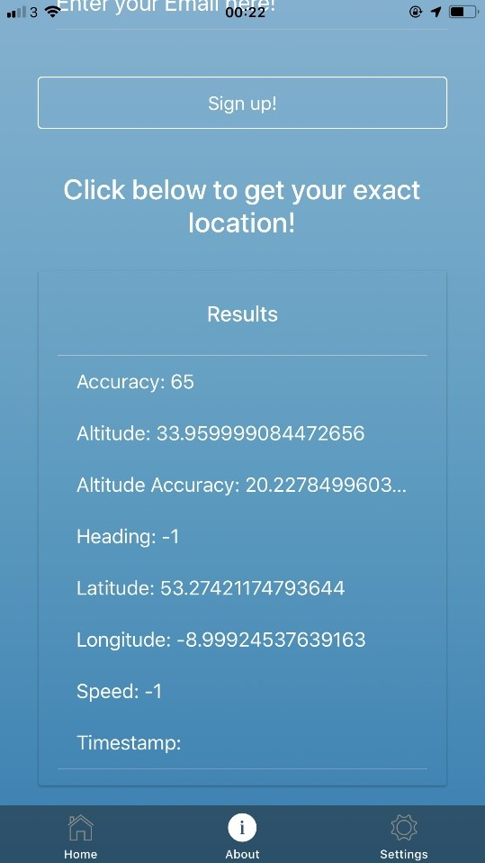

# weatherapp
<h2>First stab at ionic<h2>
 

<h2>Lets you update the location, uses the OpenWeather api<h2>
 

<h2>Also uses a cordova plugin for geolocation<h2>
 

 

 
It was a tough project as I'm not used to this framework but I am happy with how it turned out
